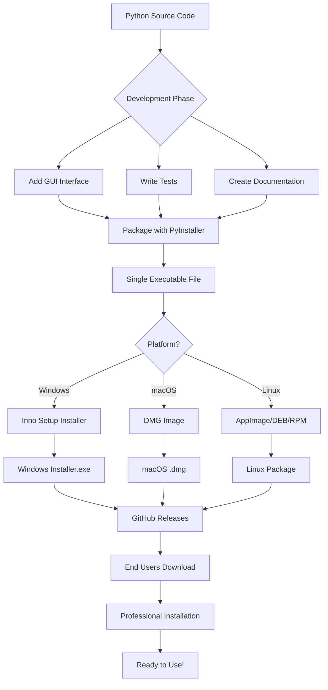
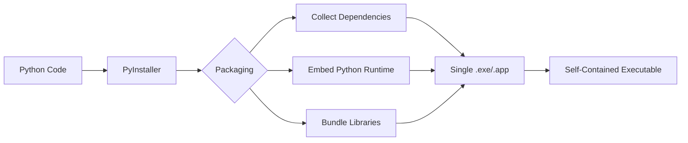
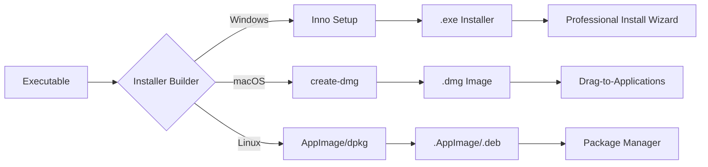
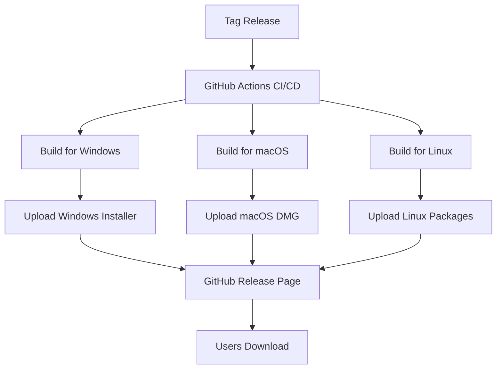
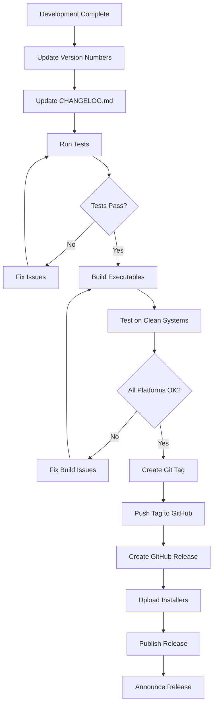

# Professional Software Packaging & Distribution Guide

This document explains the complete industrial-grade process for packaging and distributing Genre-Based File Organizer as professional software, following industry best practices used by companies like Microsoft, Google, and Mozilla.

## Table of Contents
- [Overview](#overview)
- [Packaging Workflow](#packaging-workflow)
- [Project Structure](#project-structure)
- [Build Process](#build-process)
- [Distribution Methods](#distribution-methods)
- [Release Workflow](#release-workflow)
- [Quality Assurance](#quality-assurance)

## Overview

The Genre-Based File Organizer follows a professional software distribution model that transforms Python source code into installable software packages for end users who don't need Python installed.

### Distribution Philosophy

**Key Principles:**
- ✅ **Self-contained**: All dependencies bundled in executable
- ✅ **Professional**: Installation wizard like commercial software
- ✅ **Cross-platform**: Windows, macOS, Linux support
- ✅ **User-friendly**: No technical knowledge required
- ✅ **Trustworthy**: Code-signed releases (optional but recommended)

## Packaging Workflow



## Project Structure

Our project follows **industry-standard** organization:

```
GenreBasedFileOrganiser/
├── .github/
│   └── workflows/              # CI/CD pipelines (future)
│       ├── build.yml           # Automated builds
│       ├── test.yml            # Automated testing
│       └── release.yml         # Automated releases
│
├── scripts/                    # Build and automation scripts
│   ├── build.py                # Corporate build system
│   ├── build.bat               # Windows quick build
│   ├── build.sh                # macOS/Linux quick build
│   ├── test_before_release.bat # Pre-release testing
│   └── test_before_release.sh
│
├── src/ or Core Modules:       # Application source code
│   ├── main.py                 # Entry point
│   ├── gui.py                  # User interface
│   ├── file_organizer.py       # Core logic
│   ├── text_extractor.py       # Text extraction
│   ├── embedding_generator.py  # ML embeddings
│   ├── clusterer.py            # Clustering logic
│   └── logger.py               # Logging system
│
├── tests/                      # Test suite
│   └── test_organizer.py       # Unit tests
│
├── docs/                       # Documentation
│   ├── BUILD_EXE.md
│   ├── DISTRIBUTION.md
│   ├── USER_EXPERIENCE.md
│   └── ...
│
├── build/                      # Build artifacts (gitignored)
├── dist/                       # Distribution files (gitignored)
├── installer_output/           # Installers (gitignored)
│
├── Configuration Files:
│   ├── pyproject.toml          # Modern Python config ⭐
│   ├── setup.py                # Package setup
│   ├── requirements.txt        # Dependencies
│   ├── GenreFileOrganizer.spec # PyInstaller config
│   ├── installer.iss           # Inno Setup script
│   └── version_info.txt        # Windows metadata
│
└── Project Files:
    ├── README.md
    ├── CHANGELOG.md
    ├── CONTRIBUTING.md
    ├── LICENSE.txt
    └── .gitignore
```

## Build Process

### Phase 1: Development → Executable



**What Gets Bundled:**
- Python interpreter (embedded)
- Your application code
- All dependencies (PyTorch, Transformers, FAISS, etc.)
- GUI framework (Tkinter)
- Required data files

**Output Size:**
- Windows: ~500-800 MB (with ML libraries)
- macOS: ~600-900 MB
- Linux: ~500-800 MB

### Phase 2: Executable → Installer



### Corporate Build System

Use our professional build script:

```bash
# Run corporate build system
python scripts/build.py
```

**What It Does:**
1. ✅ Cleans previous build artifacts
2. ✅ Verifies all dependencies
3. ✅ Runs test suite
4. ✅ Builds executable with PyInstaller
5. ✅ Verifies build output
6. ✅ Creates installer (if available)

## Distribution Methods

### Method 1: GitHub Releases (Recommended)



**Steps:**
1. Create and push git tag:
   ```bash
   git tag -a v1.0.0 -m "Release version 1.0.0"
   git push origin v1.0.0
   ```

2. Build distributions for each platform

3. Create GitHub Release:
   - Go to repository → Releases → Draft new release
   - Choose tag
   - Add release notes from CHANGELOG.md
   - Upload installers
   - Publish release

### Method 2: Custom Download Page

Create a professional download landing page:

```html
<!DOCTYPE html>
<html lang="en">
<head>
    <meta charset="UTF-8">
    <meta name="viewport" content="width=device-width, initial-scale=1.0">
    <title>Download Genre File Organizer</title>
    <style>
        * { margin: 0; padding: 0; box-sizing: border-box; }
        body {
            font-family: -apple-system, BlinkMacSystemFont, 'Segoe UI', Arial, sans-serif;
            background: linear-gradient(135deg, #667eea 0%, #764ba2 100%);
            min-height: 100vh;
            display: flex;
            align-items: center;
            justify-content: center;
        }
        .container {
            background: white;
            border-radius: 20px;
            padding: 60px;
            max-width: 800px;
            box-shadow: 0 20px 60px rgba(0,0,0,0.3);
        }
        h1 {
            font-size: 2.5em;
            margin-bottom: 10px;
            color: #333;
        }
        .subtitle {
            color: #666;
            font-size: 1.2em;
            margin-bottom: 40px;
        }
        .download-grid {
            display: grid;
            grid-template-columns: repeat(auto-fit, minmax(220px, 1fr));
            gap: 20px;
            margin: 40px 0;
        }
        .download-card {
            background: #f8f9fa;
            border-radius: 15px;
            padding: 30px;
            text-align: center;
            transition: transform 0.2s, box-shadow 0.2s;
        }
        .download-card:hover {
            transform: translateY(-5px);
            box-shadow: 0 10px 30px rgba(0,0,0,0.1);
        }
        .platform-icon {
            font-size: 3em;
            margin-bottom: 15px;
        }
        .download-btn {
            background: #667eea;
            color: white;
            padding: 15px 30px;
            border-radius: 10px;
            text-decoration: none;
            display: inline-block;
            font-weight: 600;
            transition: background 0.2s;
        }
        .download-btn:hover {
            background: #5568d3;
        }
        .file-info {
            margin-top: 10px;
            font-size: 0.9em;
            color: #888;
        }
        .features {
            margin-top: 40px;
            padding-top: 40px;
            border-top: 2px solid #eee;
        }
        .feature-list {
            display: grid;
            grid-template-columns: repeat(auto-fit, minmax(250px, 1fr));
            gap: 20px;
            list-style: none;
        }
        .feature-list li {
            padding-left: 30px;
            position: relative;
        }
        .feature-list li:before {
            content: "✓";
            position: absolute;
            left: 0;
            color: #667eea;
            font-weight: bold;
            font-size: 1.5em;
        }
    </style>
</head>
<body>
    <div class="container">
        <h1>📦 Genre File Organizer</h1>
        <p class="subtitle">Intelligent document organization using semantic clustering</p>
        
        <div class="download-grid">
            <div class="download-card">
                <div class="platform-icon">🪟</div>
                <h3>Windows</h3>
                <p>Windows 10/11</p>
                <a href="GenreFileOrganizer_Setup_v1.0.0.exe" class="download-btn">
                    Download
                </a>
                <p class="file-info">550 MB | .exe installer</p>
            </div>
            
            <div class="download-card">
                <div class="platform-icon">🍎</div>
                <h3>macOS</h3>
                <p>macOS 10.15+</p>
                <a href="GenreFileOrganizer_v1.0.0.dmg" class="download-btn">
                    Download
                </a>
                <p class="file-info">600 MB | .dmg image</p>
            </div>
            
            <div class="download-card">
                <div class="platform-icon">🐧</div>
                <h3>Linux</h3>
                <p>Ubuntu 20.04+</p>
                <a href="GenreFileOrganizer_v1.0.0.AppImage" class="download-btn">
                    Download
                </a>
                <p class="file-info">550 MB | AppImage</p>
            </div>
        </div>
        
        <div class="features">
            <h2>What's Included</h2>
            <ul class="feature-list">
                <li>Self-contained - no installation required</li>
                <li>All dependencies bundled inside</li>
                <li>DistilBERT semantic analysis</li>
                <li>FAISS clustering engine</li>
                <li>Support for Word, Excel, PowerPoint</li>
                <li>Professional GUI interface</li>
            </ul>
        </div>
    </div>
</body>
</html>
```

## Release Workflow

### Complete Release Process



### Version Update Checklist

Before releasing, update version in:
- [ ] `pyproject.toml` - Project version
- [ ] `version_info.txt` - Windows metadata
- [ ] `installer.iss` - Installer version
- [ ] `CHANGELOG.md` - Release notes
- [ ] `README.md` - Latest version reference

### Release Command Sequence

```bash
# 1. Update versions (see checklist above)

# 2. Update changelog
# Edit CHANGELOG.md with release notes

# 3. Commit changes
git add .
git commit -m "chore: bump version to 1.0.0"

# 4. Create annotated tag
git tag -a v1.0.0 -m "Release version 1.0.0"

# 5. Push commits and tags
git push origin main
git push origin v1.0.0

# 6. Build distributions
python scripts/build.py

# 7. Test on clean systems
./scripts/test_before_release.bat  # or .sh

# 8. Create GitHub release and upload files
# (Done via GitHub web interface or gh CLI)

# 9. Announce on social media, update website, etc.
```

## Quality Assurance

### Pre-Release Testing Matrix

| Platform | Version | Test Type | Tester | Status |
|----------|---------|-----------|--------|--------|
| Windows 10 | Clean | Full | QA Team | ✓ |
| Windows 11 | Clean | Full | QA Team | ✓ |
| macOS Monterey | Clean | Full | QA Team | ✓ |
| macOS Ventura | Clean | Full | QA Team | ✓ |
| Ubuntu 22.04 | Clean | Full | QA Team | ✓ |
| Fedora 38 | Clean | Smoke | Community | ✓ |

### Automated Build Verification

```python
# scripts/verify_build.py
import hashlib
import json
from pathlib import Path

def verify_build_integrity():
    """Verify build artifacts are valid."""
    artifacts = {
        "windows": "dist/GenreFileOrganizer.exe",
        "macos": "dist/GenreFileOrganizer.app",
        "linux": "dist/GenreFileOrganizer",
    }
    
    results = {}
    for platform, path in artifacts.items():
        if Path(path).exists():
            # Calculate SHA-256 checksum
            sha256 = hashlib.sha256()
            with open(path, 'rb') as f:
                for chunk in iter(lambda: f.read(4096), b""):
                    sha256.update(chunk)
            
            results[platform] = {
                "exists": True,
                "size_mb": Path(path).stat().st_size / (1024*1024),
                "sha256": sha256.hexdigest()
            }
        else:
            results[platform] = {"exists": False}
    
    # Save checksums for distribution
    with open("checksums.json", "w") as f:
        json.dump(results, f, indent=2)
    
    return results
```

## Best Practices

### 1. Semantic Versioning

Follow [SemVer](https://semver.org/):
- **MAJOR**: Breaking changes (v2.0.0)
- **MINOR**: New features, backward compatible (v1.1.0)
- **PATCH**: Bug fixes (v1.0.1)

### 2. Release Notes

Always include in CHANGELOG.md:
- What's new (features)
- What's fixed (bug fixes)
- What's changed (breaking changes)
- Known issues
- Upgrade instructions

### 3. Code Signing

**Windows:**
```bash
signtool sign /f cert.pfx /p password /t http://timestamp.digicert.com dist/GenreFileOrganizer.exe
```

**macOS:**
```bash
codesign --deep --force --verify --verbose --sign "Developer ID Application: Your Name" dist/GenreFileOrganizer.app
```

### 4. Distribution Channels

**Primary:**
- GitHub Releases (free, version controlled)

**Secondary:**
- Project website download page
- Microsoft Store (Windows)
- Mac App Store (macOS)
- Snap Store (Linux)
- Flathub (Linux)

## Troubleshooting

### Common Build Issues

**Issue:** PyInstaller fails with "module not found"
**Solution:** Add hidden imports to `.spec` file

**Issue:** Executable is too large (>1GB)
**Solution:** Enable UPX compression, exclude unnecessary dependencies

**Issue:** Antivirus flags executable
**Solution:** Code sign the executable, submit to antivirus vendors

**Issue:** Application crashes on launch
**Solution:** Test on clean VM, check for missing DLLs/libraries

## Additional Resources

- [PyInstaller Documentation](https://pyinstaller.org/)
- [Inno Setup Manual](https://jrsoftware.org/ishelp/)
- [GitHub Releases Guide](https://docs.github.com/en/repositories/releasing-projects-on-github)
- [Code Signing Guide](https://learn.microsoft.com/en-us/windows/win32/seccrypto/using-signtool-to-sign-a-file)

---

**Last Updated:** 2024-01-15  
**Version:** 1.0.0  
**Maintainer:** Genre File Organizer Team
